# COVID-19 infection estimates

*Originally posted at https://hmbd.wordpress.com/2020/12/30/covid-19-infection-estimates/ but I'm slowly moving the site here for getting fully automated updates and also getting rid of wordpress. Moving everything else might still take a few weeks..months.*

After spending months looking at various coronavirus dashboard, I decided to code my own plots. Starting point for all this are the [Corona plots by David Kriesel](http://dkriesel.com/en/corona) and [the dashboards and datasets provided by our world in data](https://ourworldindata.org/coronavirus). Both are excellent and I don’t try to replace them. For Germany, please also see the [reports and dashboard for the COVID-19 Simulator](https://covid-simulator.com/en/).

Instead, I’m interested in estimating actual infection counts: we test only a small part of each country and depending on how much we test, we miss a large share of all infections. This is important for many questions, like comparing countries, estimating cases when testing changes and so on. So I implemented two models for estimating actual infection numbers. Both have limitations, but when the results match, I’m reasonably confident that we’re seeing the right picture. Plots will be updated at least once per week - current data state is: 

_Please note that this is a statistics- and data-driven picture. I’m running a lot of numbers because it helps me become less confused, but if you’ve lost someone in events related to the pandemic or are directly affected in other ways (e.g. economically), this is probably not helpful._

I’ll first show my plots for Germany and the United States, then describe how the models work and finally provide a gallery with plots for ~20 different countries. 

_Note in Nov. 2021: The USA data usually has increase of test positive rate for the last few days (which then gets corrected in the following week or so) – so pls be aware that model 1 will be skewed towards higher infection rate at the end of the data._

OK, so let’s do a short description of the plots: The left side shows accumulated numbers over time (read as: how many people have had covid-19), the middle plot daily new infections (read as: how many people have been infected on each specific day). The right-side plots are just for information, so we’ll briefly discuss them later. My main point is that left and middle plots display the same data, you can pick either one depending on what interests you.
_(Starting April 2021, I’m also plotting people vaccinated / people fully vaccinated in the left plot; note that this data is currently not available for China and I’m not including vaccination rates in the middle plot as I think these are not that relevant)_

Each plot shows three different curves:

<b>Red curve: official test numbers</b> 
This is what we see in most dashboards and what get’s mentioned in public discourse: positive cases from covid-19 testing for each country (I’m using the ourworldindata.org dataset which itself currently uses John Hopkins as source for test and death numbers). For the daily new cases, I’m using a smoothed curve to avoid the daily fluctuations between weekend and workday numbers (new_cases_smoothed in the ourworldindata dataset).
Rule of thumb: if more than 1% of all tests are positive (see plot on the upper right), you should not take the official numbers at face value as we’ll miss a large share of all infections! So how can we estimate the actual numbers? That’s where the models come into play:

<b>Black curve: infections estimated from deaths and an assumed infection fatality rate (model 1)</b> 
We can estimate infections = deaths / infection_fatality_rate by using a reasonable estimate for the fatality rate (see bottom of the post for details). Update: from spring 2021 on, vaccination rates are rising and this makes model 1 outdated. So please keep this in mind when interpreting plots.

<b>Grey Curve: Scale cases with a test-dependent ratio (model 2)</b> 
The less we test, the more infections we’re missing. So we can also estimate infections by scaling the cases with our best estimate of what the number of undetected vs. detected cases should be (aka “Dunkelziffer” or dark figure).

Going back to the plot’s for Germany and United States, I’d like to highlight a few important findings:

* Model 1 and 2 align quite nicely. Since they are using completely different data inputs (model 1: deaths and infection fatality rate; model 2: testing data), I’m confident that this picture is mostly correct
* In both Germany and the United States, we’re missing a lot of infections – going by model 1 and model 2’s “best guess”, we’re only seeing one out of four infections in our testing (this matches official estimates)
So let’s see the plots for a few countries.

## COVID-19 infection estimates for various countries

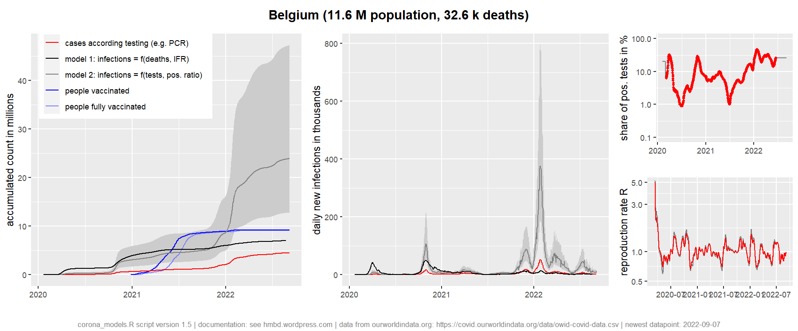
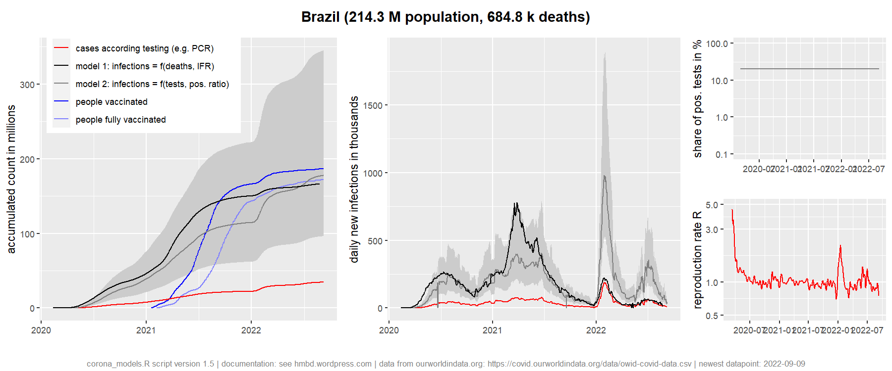
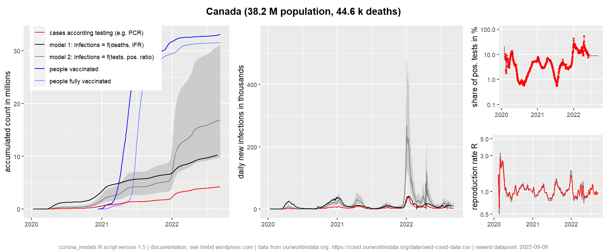
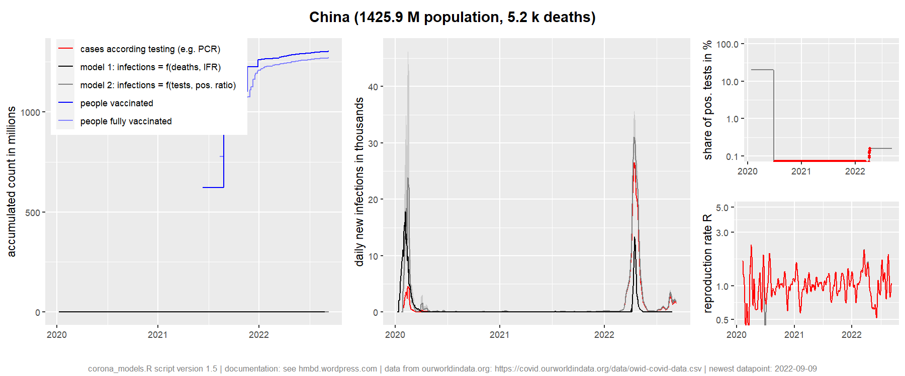

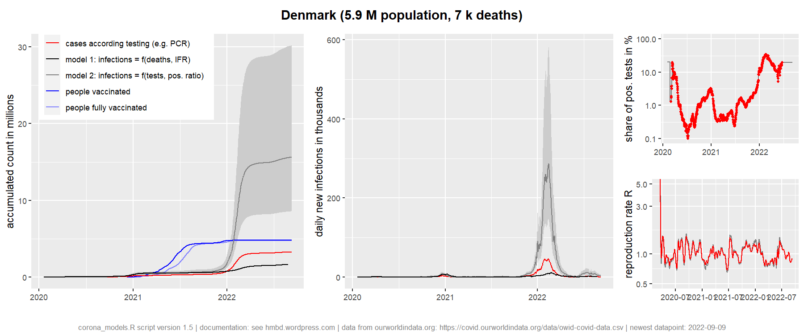
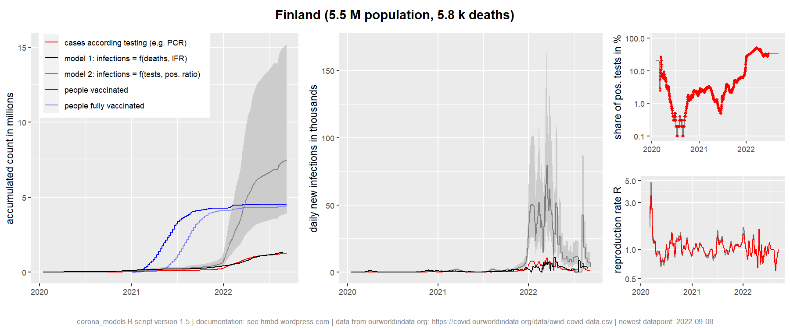
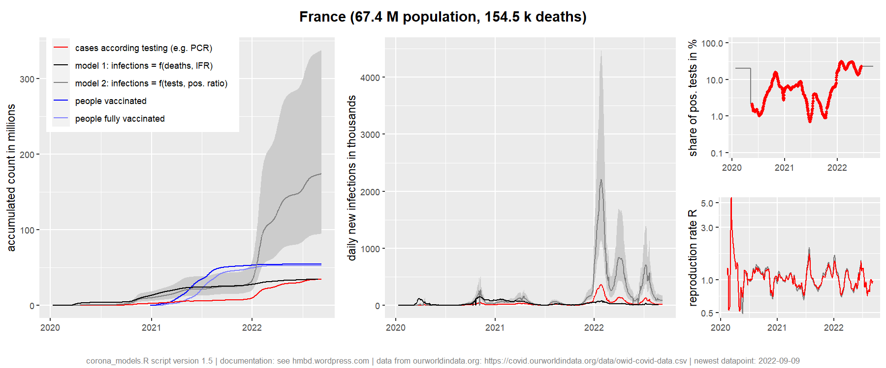

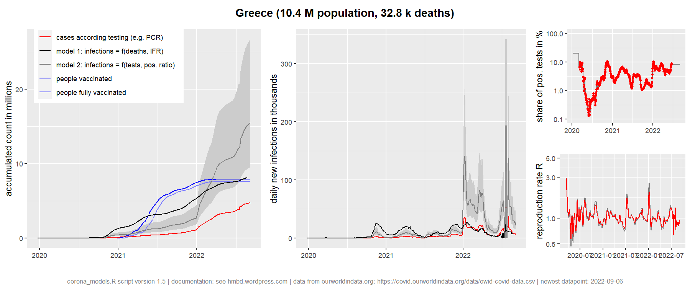

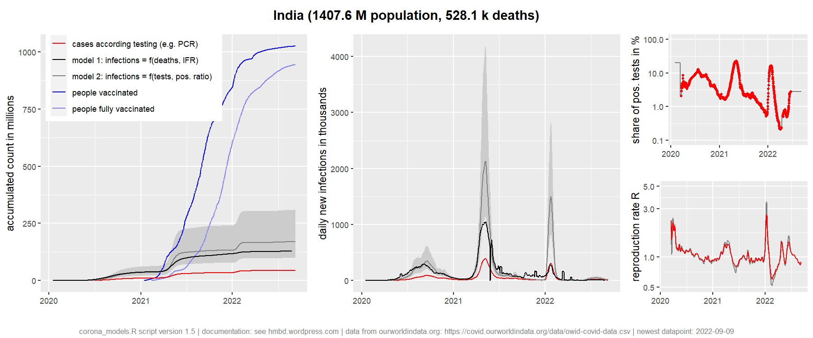
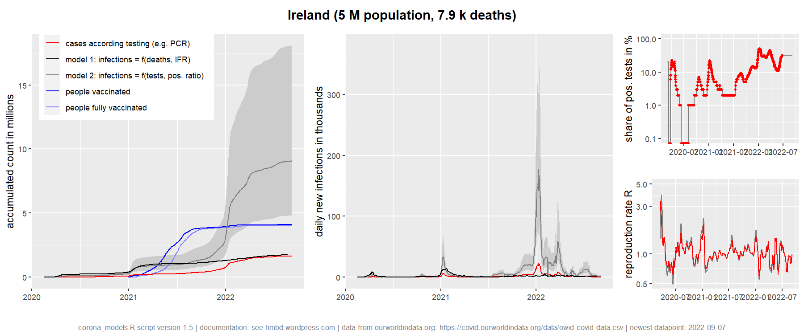
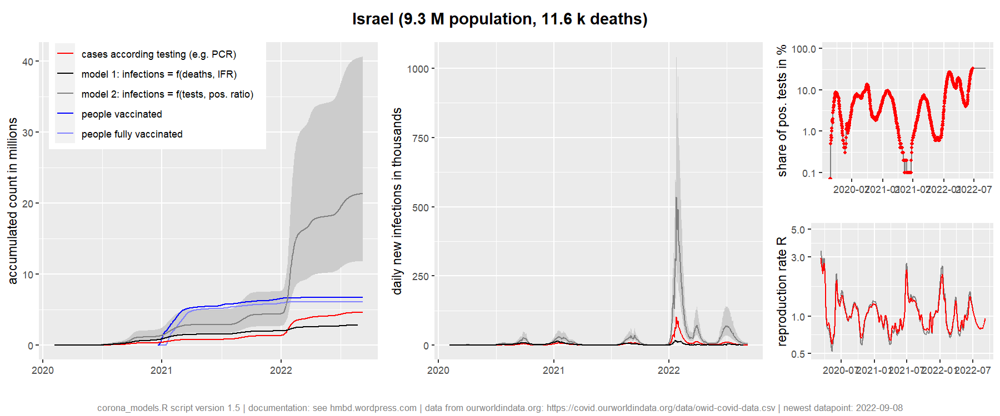

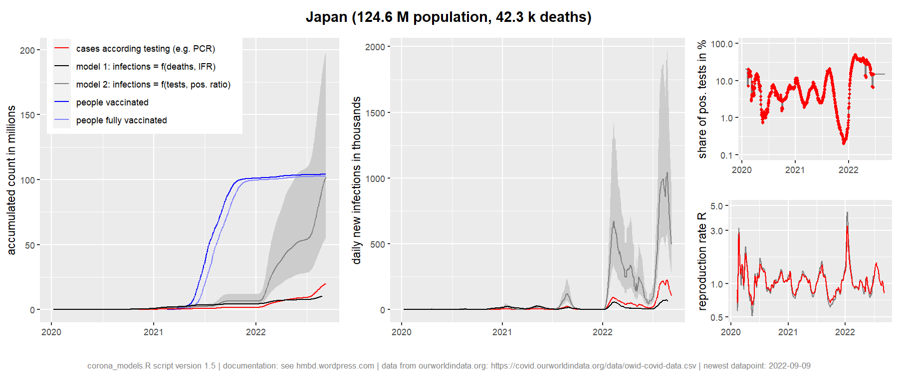
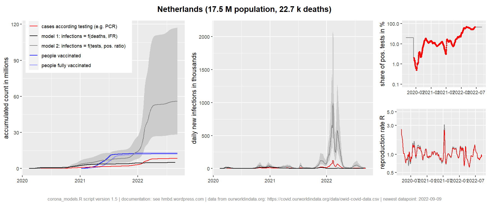

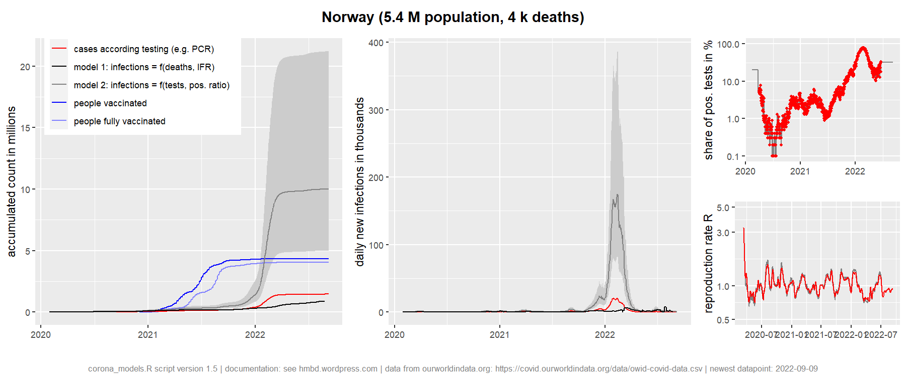
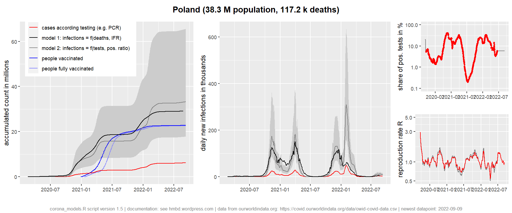
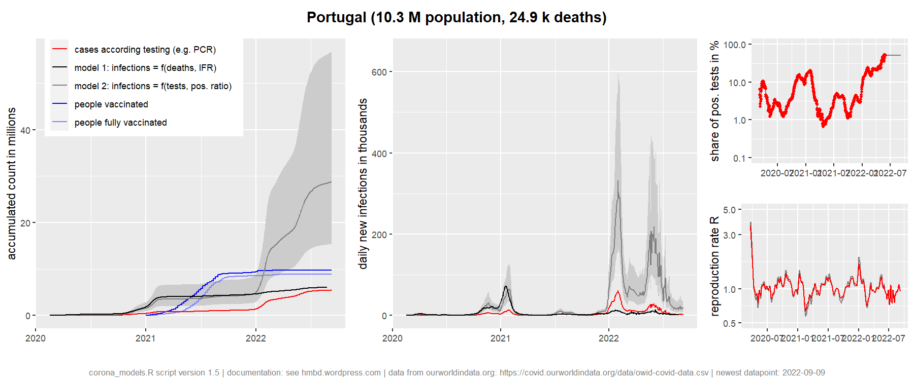
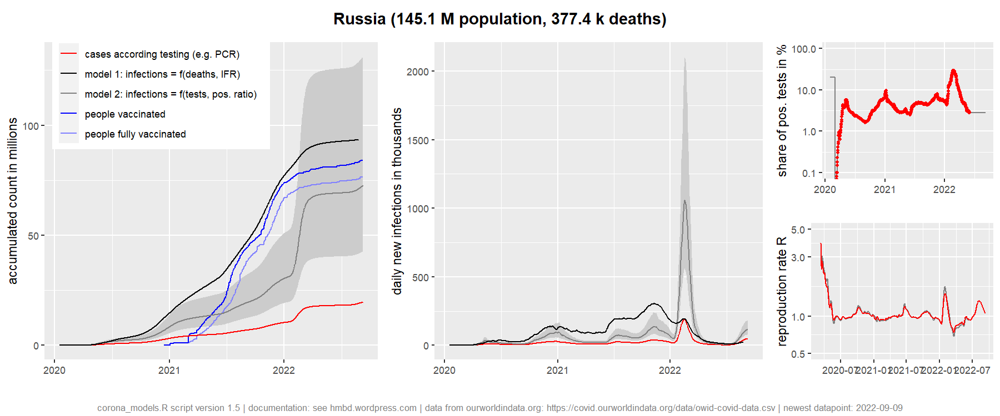
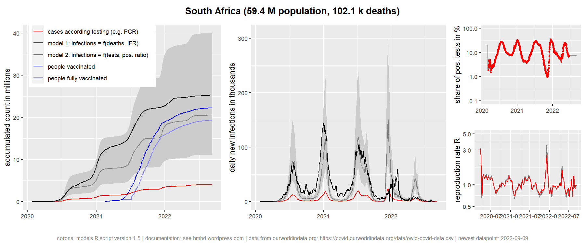
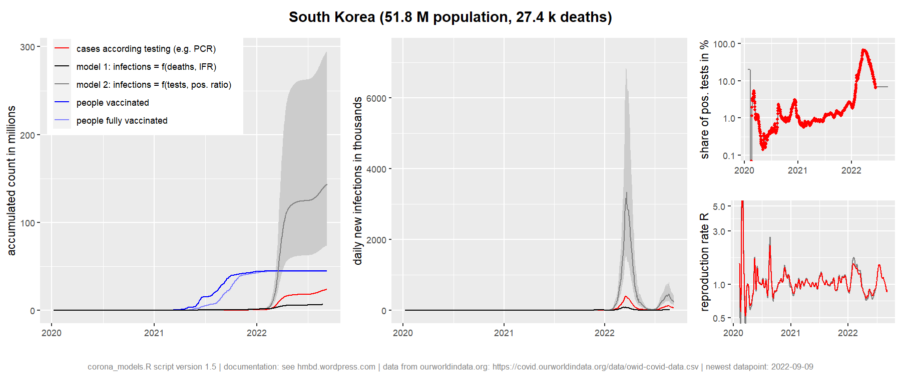

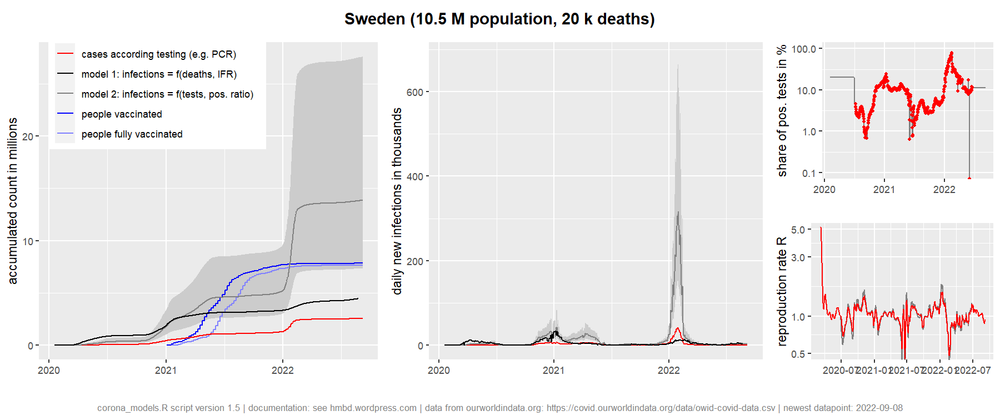
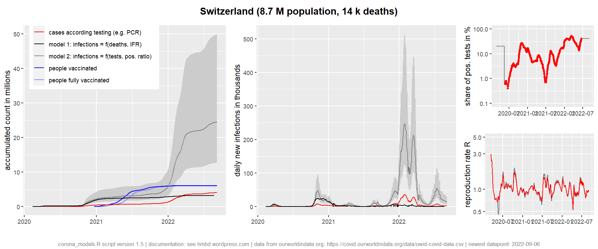
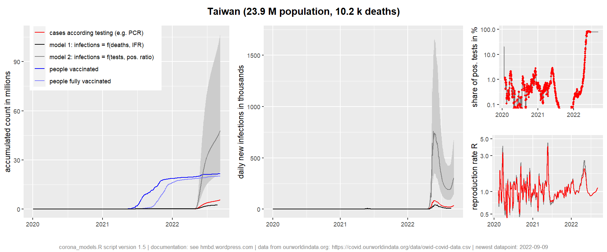
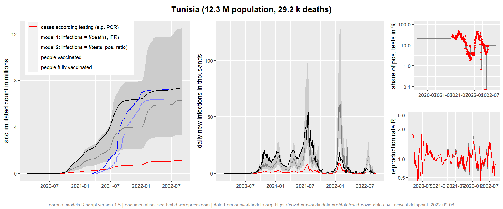
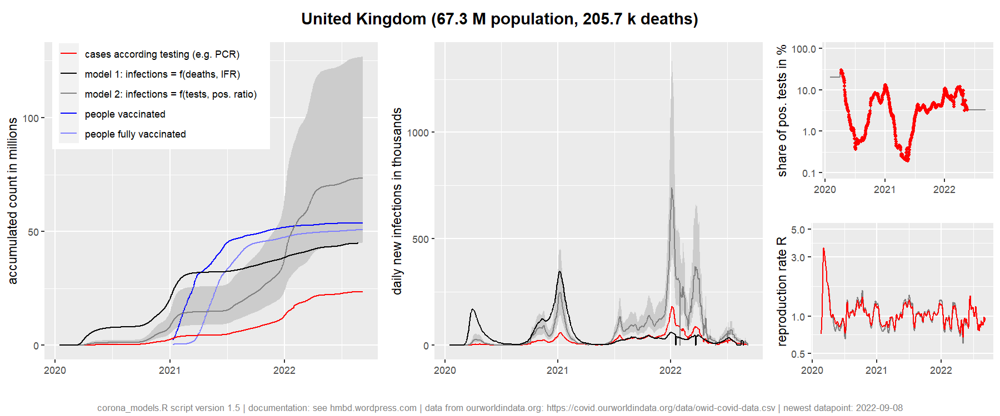

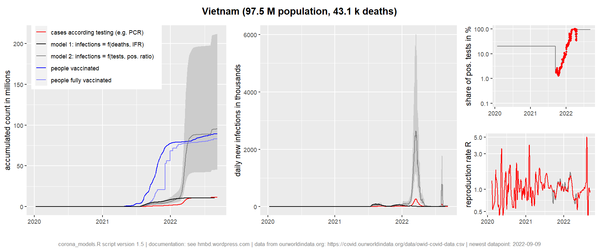

I’ll just list a few noteworthy things that present themselves to me when looking at all those plots:

* Again: for most countries, model 1 and 2 align very nicely and I’m reasonably confident that for accumulated infections, we can trust the “best guess” from model 2. For daily new infections, a lot more variation occurs and I’m maybe 80% confident that the actual truth is somewhere in the grey area of estimated uncertainty
* For a few countries, the two models diverge for the first wave in spring (e.g. Belgium, Canada, Italy). At least for Belgium and Italy, the actual infection fatality rate could have been higher than 0.8% (which would explain the deviations). Also judging by model 1, testing generally missed the first 2-3 weeks in spring in many countries (e.g. Italy, Netherlands, Spain, UK, US)
* Most of the countries I’d label as “hit rather hard” appear to have ~20% of their population infected (judging by roughly weighting in model 1 and model 2’s best guess as of early January 2021): Austria (20-25%), Brazil (25%), France (20%), Italy (20-25%), Netherlands (10-20%), Portugal (20%), Spain (20%), Schweden (20%), Switzerland (20-30%), UK (10-20%), USA (20%). Belgium leads the list with ~35%. **Update in March 2021: now many countries are reaching ~40% infection rates, but whoa look at Czechia!!!**
* If you’re looking for countries with high level of testing, check Denmark, Finnland, New Zealand, Norway, Taiwan (!)
* Countries where the models don’t agree: I’m really not sure what’s up with Australia – by looking at deaths and cases, I’d expect a positive rate of 5-10% (update Feb. 3rd 2021: I did pose the same question [here and Nick Adams pointed out that](https://statmodeling.stat.columbia.edu/2021/01/29/mortality-data-2015-2020-around-the-world/#comment-1689539) “The 2nd wave mid-year was almost entirely confined to aged-care facilities in one state (Victoria) hence the IFR is more like 5%”); Iceland had a large antibody study indicating a infection fatality rate of ~0.3%, so it’s no surprise model 1 is way off.
* Vaccinations: China is the only country where vaccinations clearly exceed the number of estimated infections (as of Jan. 8th). The country to watch is clearly Israel, with both ~20% estimated infections and another ~20% vaccinated – if they continue like this, we should see something like herd immunity some time in February.

So to summarize, I think we’re seeing a pretty realistic picture here of what’s actually going on. The uncertainty involved is frustratingly high and really I don’t think we can do much better with the data we have.

I’ll update these plots every few days just to keep track for myself. I really appreciate feedback and if you’re interested in the details, there is some more info on the calculations below.

## Model details
You’re at the end of the main article. I was intentionally very brief with the model descriptions above and I’ll add a little bit of discussion below, assuming that this will not be important for everyone.

Two things in advance:

* First: Use all this on your own risk. I’m way outside my normal areas of expertise here and I may have made mistakes or overlooked things.

* Second: Please feel free to check and expand my code. The whole script is <200 lines of code in R and [you can find it here](https://github.com/daniel-heinrich/hmbd/tree/master/covid_models). It will automatically download the newest dataset and create all plots (you need to change the target directory in line 22, that’s all) and you can easily add more countries to the mix.

Now, let’s get a little bit into details.

### Model 1 (infections = deaths / IFR)

Wikipedia[ lists some estimates for the infection fatality rate](https://en.wikipedia.org/wiki/Coronavirus_disease_2019#Infection_fatality_rate), roughly estimated at ~0.5 .. 1%. If you’re confused, theres a really good explainer on the infection fatality rate [by our world in data](https://ourworldindata.org/mortality-risk-covid#what-we-want-to-know-isn-t-the-case-fatality-rate-it-s-the-infection-fatality-rate). Here, I’ll pick a reasonably-looking infection fatality rate of 0.8% in spring and 0.4% from summer 2020 on (to account for treatment options getting better over time). I shift the results by two weeks to account for infection – death delay and that’s it, we get a crude ballpark estimate of possible infection counts.

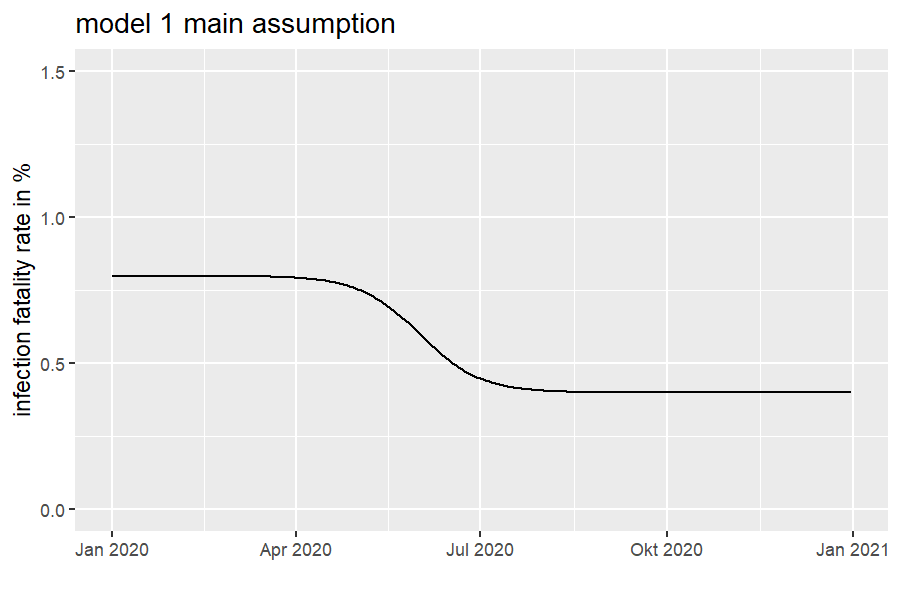

A short criticism of model 1:

* We don’t really know the infection fatality rate and my estimate might be off by a factor two (I’m fairly confident that it’s a little better for most countries, but I might be wrong). The IFR actually depends on many different factors like age distribution of infected (!!!), hospital capacity and supplies, knowledge of possible treatment options, decisions of what does or does not count as a COVID19-related death, etc.
* Deaths are spread over longer periods of time (e.g. four weeks after infection), so the curves will not be as sharp as they actually should be. This will mostly affect short-time events, e.g. maximum daily infections at peaks and should smooth out over time
* Deaths are very much behind current infections and there’s really a lot of lag. You cannot tell from model 1 what’s the current infection status out there.
* Deaths mostly occur in the high-risk group of each country’s population, so actually we can’t really infer that much about the rest of the population. In practice I think this is less of a problem as it sounds as we’ve been horribly bad at isolating and protecting people at risk.

I mostly use model 1 as a sanity check and as calibration for model 2. When doing so, I realized that I really need the reduced IFR over time for models to match. Still, I think the factor two of reduced mortality is pretty drastic and mostly attribute it to a combination of factors (better knowledge, better preparation and coordination, better protection for people at risk, …).

Model 1 does not include a measure of uncertainty. For most countries where it does not match with model 2, the reason is pretty clear (e.g. it predicts higher infection rates for Italy, Belgium, Spain and UK in the first wave, but for these countries healthcare was close to a collapse and this probably led to infection fatality rates higher than 0.8%). Since infection rates scale inverse with IFR, I can mentally adjust for this pretty easily on the fly.

### Criticism of model 2 (infections = cases * estimated_undetected_ratio)

To be specific: Model 2’s best guess is infections = cases * (1 + 300 * positive_rate)^0.4, so again, we can calculate infections directly from the official data.

_Update March 24th: With script version 1.5, I’ve modified the compensation formula. It used to give too high rates of undetected infections at high rates of positive tests, now it’s more conservative. This should mosty affect the range >15% positive tests._

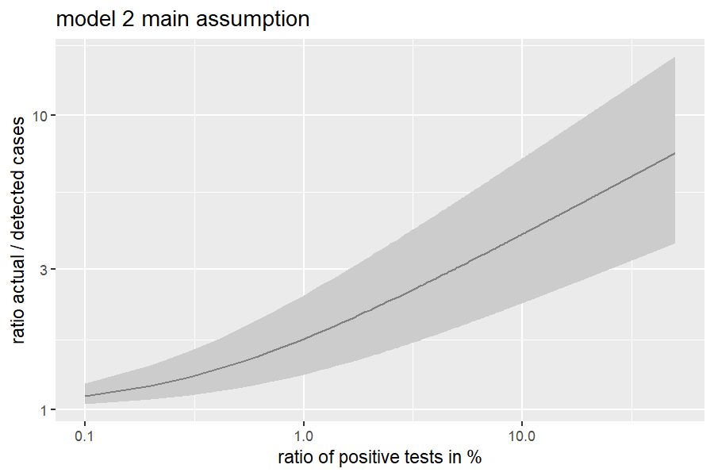

Again, this is a rather crude estimate and I account for it by including a grey “range of uncertainty” (not just here, also in the country plots). These curves lead to the following effects:

* you can only achieve a low number of undetected cases with a positive rate < 1% of all tests
* with higher number of positive tests, the uncertainty increases
* 10% positive tests correspond to ~factor 2..10 of actual vs detected cases

I only briefly explained above how model 2 estimates the ratio, so here’s the full formula:

`dark grey „best guess“-curve: 
new infections = new cases * (1 + 300*pos_rate)^0.4
light grey "uncertainty range":
new infections = new cases * [(1 + 150*pos_rate)^0.3, (1 + 500*pos_rate)^0.5] `

These formulas are obviously just made up and I did so by tuning them to model 1. I initially tried to use a linear increase, but this gave really unrealistically high infection rates at high positive rates, so I added the exponent to the formula.

Some limitations of model 2:

* Model 2 performs rather bad in very early phases of the pandemic. In most cases this is quite clear from the plots and I usually adjust to this by putting more trust on model 1 than model 2 where appropriate. As time passing on, getting the Feb. 2020 right is getting less and less important.
* Also, data on how many tests were performed / were positive is not available everywhere. The positive rate in the upper right plot is plotted red if daily data is available. If not, I keep the previous datapoint until a new one is available (e.g. for Germany and the US,), this will show up as a grey curve in the plot. If no previous data is available, I set this to 20% (e.g. first wave in France, total time for China)
* The model has a frustratingly broad range of uncertainty and I think this is basically as good as we can do without adding information of how exactly each country is testing.

The plot on the lower right is the reproduction rate R, evaluated by the ratio of new cases (smoothed) over four days: new_cases / new_cases_4_days_earlier. It appears to match calculations elsewhere in a reasonable way. Since rising cases also usually lead to rising ratio of positive tests, model 2 estimates slightly more aggressive fluctuations for the reproduction rate than the official data does. (Update with version 1.4: I’ve now added a smoothing over 10 days for the reproduction rate – it now shows long-term trends better and I don’t really think short-term fluctuations were that meaningful.)

All things considered, I think model 2 is pretty good as long as you account for the limitations discussed above in your interpretation. So really please shift your trust between model 1 and model 2 in a reasonable way.
