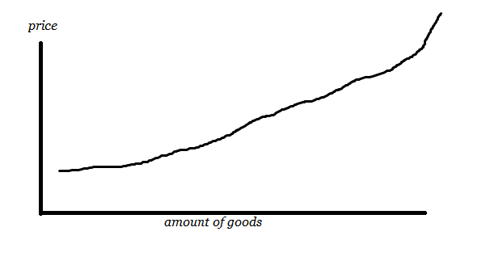
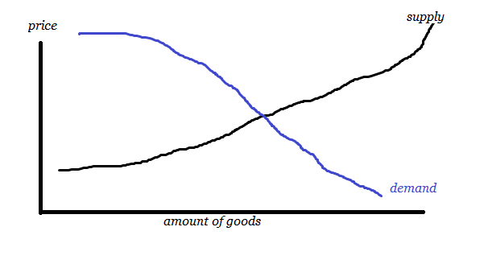
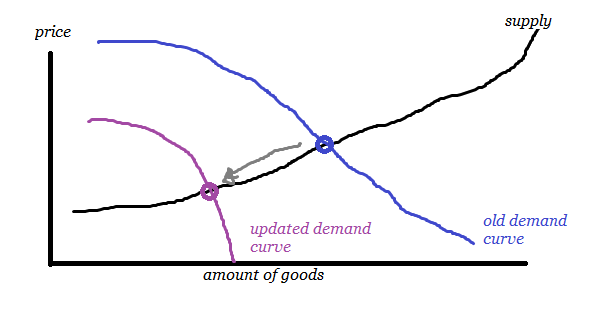
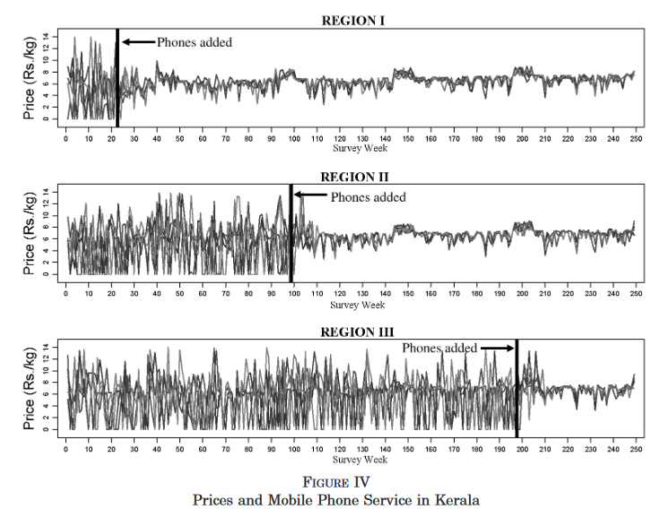
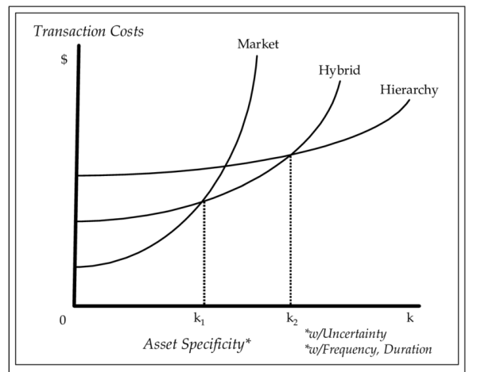

# What markets can and cannot do  
  
I spent some time reading up on economics and figured I might as well just write a summary. Quick warnings:

1. Reading time: 30 minutes for the post, 5h+ if you follow all links. I highly recommend following the links. At least pick a few interesting ones. 
2. I mostly buy into a pro-market view here. If you are very much against capitalism per se, this post will probably not be worth your time. Sorry. 
3. Also, this is for getting me up to speed on standard economic theory. If you've already studied economics, nothing in here will be new to you, but I'd really like to hear your feedback.

## Part 1: Ideal Markets

(We're starting with the very basics. If you already know this stuff, consider jumping directly to part 2 or 3)

Coordination problems are tough problems. See [the SSC book review of Red Plenty"](https://slatestarcodex.com/2014/09/24/book-review-red-plenty/):    

> Red Plenty presented the problem with the Soviet economy primarily as one of allocation. You could have a perfectly good factory that could be producing lots of useful things if only you had one extra eensy-weensy part, but unless the higher-ups had allocated you that part, you were out of luck. If that part happened to break, getting a new one would depend on how much clout you (and your superiors) pulled versus how much clout other people who wanted parts (and their superiors) held.  
  
One solution discussed in Red Plenty is Kantorovic's approach to mathematical optimization. Unfortunately, this does not work on practical levels of a national economy, if only for the amount of computation power available (see [Cosma Shalizi's discussion](https://crookedtimber.org/2012/05/30/in-soviet-union-optimization-problem-solves-you/) for details).
  
So we want to have ...goods or whatever else... allocated in an economy at a reasonable rate and a global gods-eye approach to distribution is practically impossible. This appears to be one of the cases for a market-based allocation of goods. 

The standard model on markets is the supply and demand model, sometimes called competitive markets model. I found [this investopedia article a good introduction](https://www.investopedia.com/articles/economics/11/intro-supply-demand.asp). (also see [chapter 3 of Hutchinson: Principles of Microeconomics, 2016)](https://pressbooks.bccampus.ca/uvicecon103/chapter/introduction-to-supply-and-demand/). The core idea is:

* supply side: when price increases, more of a good will become available (as more obscure / expensive sources will also be willing to provide it)
* demand side: the cheaper something is, the more people will be interested in buying it.

So think of something like fish. If a trout is guaranteed to sell for 20 bucks, lots of people will start producing, even if it's a pain to farm them in their garden pool. This means we get a curve like this:

On the other hand, not everyone is keen to eat trout. But if it gets really cheap, maybe? If trout is cheaper than bread, maybe some people would substitute bread with trout? And if it gets cheaper than grass, maybe there's a way to [feed your cattle](https://en.wikipedia.org/wiki/Fish_meal) with it? So we get a demand curve that looks like this:

… and we expect the market to solve for the crossing point. This view is always a snapshot of the current state: if either supply or demand changes, the equilibrium point will also change:

(Often, those curves are drawn as straight lines, but there's no reason they have to be. I chose MS-paint style nonlinear curves for the examples above for aesthetic reasons.)

The inverse steepness of the line is referred to as elasticity: A demand-side elasticity for petrol would mean you only drive your car if petrol is reasonably cheap; if everyone has to drive to work no matter what this will mean low elasticity and folks will pay whatever price the market asks. 

Lets discuss application and limits on a practical example. To begin with, the ideal market model above rests on four[ core assumptions](https://open.lib.umn.edu/principleseconomics/chapter/9-1-perfect-competition-a-model/):

1. identical or at least sufficiently comparable goods
2. many buyers and sellers (no monopoly)
3. free entry and exit of the market
4. perfect information

Theres a nice paper by [Robert Jenssen: "the digital provide: information (thechnology), market performance, and welfare in the south indian fisheries sector" (2007)](https://web.stanford.edu/class/comm1a/readings/jensen-digital-divide.pdf) that I'll use here for illustration. I encourange you to read the first five pages, but I'll quote the core segment's here:

> Fishing is an important industry in Kerala. For consumers, fish is a dietary staple; over 70 percent of adults eat fish at least once a day, making it the largest source of many important nutrients, such as protein. (...) However, a significant limitation to fish marketing is that while at sea, fishermen are unable to observe prices at any of the numerous markets spread out along the coast. Further, fishermen can typically visit only one market per day because of high transportation costs and the limited duration of the market. As a result, fishermen sell their catch almost exclusively in their local market. In addition, there is almost no storage (due to costs), and little arbitrage on land due to poor road quality and high transportation costs; ultimately, the quantity supplied to a particular market is determined almost entirely by the amount of fish caught near that market.

So there are limits to how well the market works:

> There is a great deal of price variation, with some markets having an effective price of zero (fishermen arrive to find all buyers have departed) while others range from 4.0 to as much as 9.9 rupees per kilogram (...). Note in particular that Badagara has a price of zero while Chombala and Quilandi, both within fifteen kilometers, have prices of 9.9 and 9.8 Rs/kg, respectively. Since an average boat on this day was carrying 381 kg of fish and the fuel cost of traveling fifteen kilometers was about 205 Rs, a boat arriving at Badagara was forgoing as much as 3,400 Rs in profit. Columns (2) and (3) show this from another perspective, with data on the number of “excess buyers” (wholesalers/retailers who report having bought no fish because of high price or inadequate supply) and “excess sellers” (fishermen who arrive at a market and find no buyers and therefore dump their catch in the sea).

Over the course of a few years, mobile phones become gradually available in several regions and are quickly adopted by fishermen. The graph on page 21 tells the story best:

They summarize:

> Using microlevel survey data spanning this period, we find that price dispersion was dramatically reduced with the introduction of mobile phones; the mean coefficient of variation of price across markets (...) declined from 60 –70 to 15 percent or less. In addition, there were also almost no violations of the Law of One Price once mobile phones were in place, compared to 50 – 60 percent of market pairs before. Further, waste, averaging 5– 8 percent of daily catch before mobile phones, was  completely  eliminated. Overall, the fisheries sector was transformed from a collection of essentially autarkic fishing markets to a state of nearly perfect spatial arbitrage.

In the example above, availability of phones switched the market from "wildly fluctuating and pretty flawed" to "pretty close to a perfect market". Fluctuations are low, goods get allocated efficiently, everyone's happy. Standard economic theory assumes that this mode of efficient operation is unbeatable by any other mechanism; it would not be possible to achieve the same amount of efficiency by something like a state-run mode of distribution.

(While we're at it, I'd like to note that not everyone agrees with Jenssen's paper. See [here for an example critique](https://www.ictworks.org/wp-content/uploads/2016/06/fishermen-do-not-use-phones.pdf), claiming both methodological errors and inconsistencies between the paper's reporting of evidence and the critique author's sources. I haven't had the time to evaluate the critique - I mainly use Jenssen's paper here as a very handy way of visualizing core concepts, not as a factual claim on how fish markets in India actually work.)

One could object to the market efficiency here that the price still has small dents and fluctuations even after phones have become available. This may partially just be changes in the equilibrium point - at least, there's a pretty regular pattern maybe correlating with something like seasons and/or holidays. While we cannot tell for sure what caused the change of prices, we can say for sure that at least something happened here. This is another important characteristic of markets: _Besides allocating goods, a market makes information available_. As far as I can tell, this concept was introduced by Hayek's 1945 essay "the use of knowledge in society". [Wikipedia](https://en.wikipedia.org/wiki/The_Use_of_Knowledge_in_Society): 

> A decentralized economy thus complements the dispersed nature of information spread throughout society. In Hayek's words, "The marvel is that in a case like that of a scarcity of one raw material, without an order being issued, without more than perhaps a handful of people knowing the cause, tens of thousands of people whose identity could not be ascertained by months of investigation, are made to use the material or its products more sparingly; that is, they move in the right direction."

Here, the information the market gives us is primarily "what's the current local price for fish", but there are other cases where the market carries really interesting information on top - like treating stock market prices as an assesment of a company's health (albeit an imperfect one, you'll have to normalize with a reasonable reference). In cases like [prediction markets](https://en.wikipedia.org/wiki/Prediction_market), markets get created with the specific goal of making information available.

To sum up part 1: markets are very good at allocating goods, given that a structure somewhat close to an ideal market is possible. In that case, efficient allocation occurs and the market follows a "law of one price" where stuff is priced identical +/- transportation costs. As a secondary effect, the price carries information, which, depending on the market's nature, may even be the primary point.

## Part 2: Imperfect Markets

One could generalize the example above (and [standard neoclassical economic theory](https://en.wikipedia.org/wiki/Neoclassical_economics) that goes along with it) to something like "markets are always better at, you know, stuff that markets do". So… um… let's briefly read up on [market failure](https://en.wikipedia.org/wiki/Market_failure):

> Market failures can be viewed as scenarios where individuals' pursuit of pure self-interest leads to results that are not efficient – that can be improved upon from the societal point of view. (...) Market failures are often associated with [public goods](https://en.wikipedia.org/wiki/Public_goods "Public goods"), [time-inconsistent preferences](https://en.wikipedia.org/wiki/Time-inconsistent_preferences "Time-inconsistent preferences"), [information asymmetries](https://en.wikipedia.org/wiki/Information_asymmetry "Information asymmetry"), [non-competitive markets](https://en.wikipedia.org/wiki/Market_structure "Market structure"), [principal–agent problems](https://en.wikipedia.org/wiki/Principal%E2%80%93agent_problem "Principal–agent problem"), or [externalities](https://en.wikipedia.org/wiki/Externalities "Externalities").

(Actually, wait, no, don't read all these links unless you're really into it. For an introduction with more examples, please see ["part A: economic issues" of the non-libertarian FAQ (SSC)](https://slatestarcodex.com/2017/02/22/repost-the-non-libertarian-faq/#economic_issues). If you already followed up all the links above before reading this paragraph, sorry. )

At this point I'd like to point out most economists are really sensible about all of this (see for example [this 2007 econtalk episode](https://www.econtalk.org/boudreaux-on-market-failure-government-failure-and-the-economics-of-antitrust-regulation/)). Standard view is not that the market always fixes itself but more like a humble view of "we should not expect anyone to know for sure what's best, so let's try to have a system where different ideas can compete". You can expand the standard model in [all kinds of reasonable ways](https://www.investopedia.com/terms/i/imperfectmarket.asp) to include deviations from perfect markets (to give one example: If I got this right, standard econ theory predicts fewer transactions than actually occur and you can change from a "perfect information exists" to a [bounded rationality](https://en.wikipedia.org/wiki/Bounded_rationality#Behavioral_economics) model to account for that)

So there are all kinds of ways economists think about this, but I found the theory of transaction costs to be particularly helpful. [To grab an example from this excellent introduction](https://oxfordre.com/business/view/10.1093/acrefore/9780190224851.001.0001/acrefore-9780190224851-e-6):

> Suppose you go to the grocery store to buy a carton of milk. You get the carton from the refrigerator, pay $3 at the register, and walk out. The transaction in this example is simple in that we seldom stop to think about it. Simplicity stems from two pillars that most of us take for granted. One, we know how much a carton of milk is supposed to be priced at retail, and those who do not can find out at a negligible cost. In short, the _price system_ works to the buyer’s advantage in the transaction. Two, at least in the United States, we are assured that the quality of dairy products is intact.

So if transaction costs are low, markets work. If they are high, not so much:

> The dairy product transaction looks simple to us because it is supported by the price system and the system of institutions. Those who live in the developing countries, or travel in them, know that simplicity is in fact only ostensible. Specifically, absent the proper system of institutions, buying even dairy products becomes so complex and risky that many will refrain from using them. In economic terminology, “the market fails” in that even though both supply and demand exist, the transaction will not take place.

The article moves on to other examples, like automotive supplier contracts and an antitrust case against a bike manufacturer in the 1970s. They all share a difficulty of assessing product quality (comparable to the milk example above) and the companies involved looking for other ways to insure quality instead of "just buy on an open market from whoever provides the cheapest price on a daily basis". 

_Transaction Costs Economics_ (TCE) is a framework for assessing these trades. It assesses transactions based on frequency, uncertainty and specifity. Specifity refers to how much special preparations are needed for a trade. Think of a trade that requires a supplier to set up a large production facility close to the customer: This is only a good deal if the supplier can expect to keep this contract for a long time (or sell the set-up site once the job is finished) but not if he has the risk of loosing the contract at any time without being compensated for the initial investment.

> A simple transaction has low frequency, low uncertainty, and low specificity. Such transactions can be efficiently handled through a market transaction between a supplier and a buyer. Returning to the grocery store and our purchase of the carton of milk, the transaction is routine in that it has little uncertainty, low asset specificity, and virtually no risk associated with it: therefore, the transaction is most efficiently handled through a straightforward market exchange. TCE provides an explanation for why simple transactions are organized as market transactions between a buyer and a seller, but provides insight particularly in the context of complex transactions that involve high degrees of specificity (Williamson, [1985](https://oxfordre.com/business/view/10.1093/acrefore/9780190224851.001.0001/acrefore-9780190224851-e-6#acrefore-9780190224851-e-6-bibItem-0040), p. 52). A supplier of make-and-model-specific components or sub-assemblies to a final automobile assembly plant is a good example (Klein, Crawford, & Alchian, [1978](https://oxfordre.com/business/view/10.1093/acrefore/9780190224851.001.0001/acrefore-9780190224851-e-6#acrefore-9780190224851-e-6-bibItem-0021)). Applying the TCE logic, Monteverde and Teece ([1982](https://oxfordre.com/business/view/10.1093/acrefore/9780190224851.001.0001/acrefore-9780190224851-e-6#acrefore-9780190224851-e-6-bibItem-0026)) predicted that automakers would be more likely to make in-house components that required greater make-and-model-specific applications engineering. In contrast, components whose specifications are known ex ante immediately become candidates for competitive bidding and outsourcing because the transaction costs are presumed to be comparatively lower.

Other sources provide very nice diagrams for what market forms will work for what amount of transaction costs (this one here is taken from [Whittington & Dowall, 2008](https://www.researchgate.net/publication/45940805_Transaction-cost_economic_analysis_of_institutional_change_toward_design-build_contracts_for_public_transportation)):

Hierarchies are things like vertical integration (e.g., Tesla producing both electric vehicles and running charging stations, which makes a lot of sense from TCE perspective - think high frequency and high specificity). Hybrids are somewhere in the middle, like joint ventures or other forms of very close cooperation between companies. Generally, a pure market mechanism excels in cases of low transaction costs (this brings us back to the "market allocation is unbeatable by any other mechanism" concept from neoclassical theory). If it's very expensive to find trade partners, to negotiate and to enforce trades (all flavors of high transaction costs), pure markets are typically not very good and other mechanisms will work better.

To illustrate, I'll use the example from [this econ talk episode](https://www.econtalk.org/boudreaux-on-coase/) with Coase's 1974 paper "The Lighthouse in Economics". The issue with lighthouses is that they are a kind of public good: boats need them to safely find the harbor, but there's no way a lighthouse can set up a market by excluding boats from the service or that several lighthouses might efficiently compete with their services at the same harbor. So by definition, we have high specifity and high frequency; so we should be somewhere on the right side of the graph above with some kind of pretty hierarchical solution emerging. Coase went out and studied examples of historical arrangements for lighthouse operation:

> The contractual arrangements that harbor-builders and dock- or harbor-owners (...) would arrange with boats coming in were ingeniously designed to enable lighthouses to collect fees, allow the suppliers of lighthouse services to collect fees for the provision of those services. The naive view that a lighthouse is a straightforward public good, unless it's provided outright by government and funded exclusively through taxation--and lighthouses early on in Great Britain were _not_ funded in this way. (...) They were funded in large part by fees that boat owners did pay. And this is an example of Coase saying, well, let's look at the history. And the history of lighthouses is far more complex than the notion you get by reading the standard textbook story about a lighthouse.

So TCE is not like a natural law that tells you what solution _has_ to emerge, but gives a robust framework for understanding reality nonetheless. It allows you to think on how the structure may change if transaction costs changes. Typically, TCE gets applied to company structures (e.g., the automotive supply chain discussions we discussed above), but [this primer to the topic in German](http://schneider-dietram.de/wp-content/uploads/2017/11/Transaktionskostentheorie-1.pdf) closes by discussing how relationships have evolved in recent decades: By better birth control, transaction costs for sexual exchange have been lowered and thus the typical exchange structure is shifting from very hierarchical structures (marriage, closely tied-together families) to more market-like structures (dating, polyamory, ...). I don't think we should take this example very serious, but it's a fun one nonetheless.

## Part 3: Applied Market Mechanisms

Since my personal target for reading up on all of this was to get better intuitions on how markets should behave, let's close here by discussing a few examples. This serves as a playground for me to lay out my own thinking and I'm very open to corrections and comments. Even less than the rest of this post, this here is not "things I'm already certain of" but for laying out my understanding.

### A) If markets are so great, why can't we use them to end world hunger?

Standard economic theory and the _law of one price_ from the ideal markets part should mostly work for tradeable goods like wheat, corn and rice, as they are great examples for goods where all the limitations I discussed above do not apply. So rice should be roughly the same base price +/- local taxes and transportation costs everywhere in the world. This sounds to me like a good reason for why [unconditional cash transfers work](https://www.givewell.org/charities/give-directly) - you can just send people cash and if they need to buy food, the market will supply. This will work as long as regions are sufficiently connected to the global market; so if high transportation costs or taxes remain in the way, this reasoning may not fully apply (but sending cash might help nonetheless).

Unfortunately, the thing about the price carrying information also applies here. I can directly modify the Hayek quote from part 1 to: "in a case like that of a scarcity of one _food_ (...) tens of _millions_ of people whose identity could not be ascertained by months of investigation, are made to use the material or its products more sparingly". If you're not living off 1$ per day, food getting more expensive is just an annoyance, but for people already using all their money to feed themselves, this is lifethreatening and price surges as seen currenty for wheat and rice will lead to a global famine. 

(Note to future readers: this was written in 2022 and we're 3 months into the russian invasion into ukraine, with food prices already rising and projections of global food shortages on the table).

My understanding is that a global market also means that foods will automatically be distributed in attractive directions. Just making sure everyone has enough money to at least buy base commodities would be really great and would be a good reason to donate to the right charities. If you're a state actor, putting aditional taxes on wasteful uses for food might further help, as we should then expect the market to adjust towards those in need.

So, um, I actually think if we had a magic way to send every person on earth … say 3$ per day, we'd probably end world hunger as markets would take care of the rest. Maybe [we should do that](https://www.givedirectly.org/)?

### B) Minimum wages

(source: [this german podcast on economics](https://wrint.de/2022/02/22/wr1335-an-inflation-oder-mit-inflation/))

Standard economic theory implies that [minimum wages](https://en.wikipedia.org/wiki/Minimum_wage) are bad. The reasoning goes like this: Suppose you want to maximize economic output (and societal wealth). Then there are two ways introducing a minimum wage can go:

1. The required minimum wage is lower than the actual lowest wage out there. In this scenario, everyone will choose the best-paying job they want to do and the minimum wage will have no practical effect.
2. If the legal minimum wage raises actual wages, this will affect people who previously couldn't get any better-paying jobs. These jobs previously didn't produce enough value to justify higher wages (if they did, why did employees stay instead of switching to better-paying jobs?), so raising the wage will either mean the employer terminates the job or will go bankrupt. In both cases, this will lead to previously employed people now being unemployed.

In this model, a minimum wage is at best meaningless and at worst will lead to unemployment and lost wealth. So instead of raising the minimum wage, the state should better do some redistribution from high earners (have them pay high taxes) to low earners (subsidize with social welfare). 

At this point we need to introduce the concept of a [monopsony](https://en.wikipedia.org/wiki/Minimum_wage#Monopsony). While a monopoly implies there's only one seller, a monopsony means there's only one buyer. Think of a small town that only has one big employer: you either choose to work for them or move somewhere else. This company thus has a limited number of workers available at a low wage, but if they want to increase their workforce, they'd have to dramatically increase everyones wages to attract new employees willing to move here. In this case, the best strategy for the company is to stay at it's size and keep the wages low. 

In the last 30 years, [the evidence has come in](https://en.wikipedia.org/wiki/Minimum_wage#Card_and_Krueger):

> Card and Krueger expanded on this initial article in their 1995 book _Myth and Measurement: The New Economics of the Minimum Wage_. They argued that the negative employment effects of minimum wage laws are minimal if not non-existent. For example, they look at the 1992 increase in New Jersey's minimum wage, the 1988 rise in California's minimum wage, and the 1990–91 increases in the federal minimum wage. In addition to their own findings, they reanalyzed earlier studies with updated data, generally finding that the older results of a negative employment effect did not hold up in the larger datasets.

You can read up on the followup studies [on Wikipedia](https://en.wikipedia.org/wiki/Minimum_wage#Research_subsequent_to_Card_and_Krueger's_work), but these days, the consensus seems to be that a minimum wage at a moderate level increases production and wealth. The participants of the podcast I started with gave a rough estimate of a minimum wage up to 60% of the median wage is helpful while higher wages will slowly start to produce the negative effects from classical economics we started with.

### C) Price negotiations via auctions

A friend of mine works in a car company. A few years ago, they needed a relatively complex component for a series of new engines. The new engines required it to work, but it was twice as expensive as the previous technology and only a very limited number of companies were potential suppliers. In the end, they had two suppliers as potential candidates, but didn't want to give the full volume to one of them (splitting the total volume and having an alternative if one company has quality or supply chain issues sounded like a good deal). So how do you split the price and volume?

They ended up doing a bidding tournament: They had both companies on site in separate meeting rooms and presented each one a list of offered prices for different engine variants. If they were willing to provide the volume for engine A at, say 52$ per piece, but not the volumes for engines B, C and D (each at other prices due to technical differences), they would get that volume. The rest of the volumes would then be offered to the second supplier at slightly increased prices (who was very well aware that parts of the total volume were already taken); the variants the second company didn't choose again got their prices raised and were offered back to the first supplier.

This mechanism is like an inverse auction: You don't get to bid prices up; instead the price slowly get's raised, but whoever is willing to to take it gets it. From what I heard, this was a process that both put a lot of stress on the suppliers to take the lowest price they were willing to work for, but also ensured they only took offers that were economically feasible. Everyone agreed afterwards that this process was really tough, but fair - that's important if all participants have to continue cooperating afterwards.

Moral of the story: Standard economic models usually assume an auction mechanism for price determination. This directly applies to the example above and to selling stuff on Ebay, but not to picking up a bag of flour in your local supermarket. While auctions are really good for determining the "correct" price for something (maximum or minimum, depending on how you set them up), they are also a lot of effort to set up; so we only use them if they are really worth the effort.

### D) Do we need more markets for education?

Which school or unversity to attend is a tough decision, as it will dramatically affect your kids / your future path but there's no way to say in advance which way those paths will go. As a state's education ministry (or as a taxpayer), you really want your citizens to get an as good education as possible (as this gives your country better competitiveness, higher economic growth, ...). 

Can't we like wave a magic wand and transform all of education into an automatic market mechanism for allocating decent lessons? For existing school systems, many countries have chosen a highly hierarchical, not very market-based approach to education. This makes lots of sense based on transaction cost economics (in the above categories, schooling has high frequency as students visit school/university each day; high specifity as dedicated houses are needed and especially high uncertainty as quality and individual requirements are notoriously difficult to accurately assess).

One of the interesting aspects I only noticed recently is that one can interpret a lot of newer education reforms as attempts to reduce transaction costs within education:

* rankings and standardized tests attempt to make school and student performance comparable
* the credit system implemented in bachelor / master studies attempts to make switching universities easier.

I'm not really sure how much this works; maybe if we didn't have these, we'd be much worse. Still we are in a situation where it makes a lot of sense to pick a top-tier university instead of attending free online courses even for uncertainty and prestige reasons. There have been a few attempts lately to change this, but I don't feel qualified to assess how well those work.

I don't really have a good summary here; maybe there isn't one - which would explain all this controversity about how to build a good education system.

### E) everything else (closing thoughts)

So suppose you want to design a market for some unsolved problem that's been bugging you. Or your employer does and you're wondering what it will mean for you. What should you do?

Probably a good question is how close to an ideal market you can get. Can buyers and sellers enter and exit without high costs? Is information sufficiently available? Or can you make it available, for example by introducing a product rating system? (if you're into video games: consider how Steam has user ratings for each game, but the Nintendo eshop hasn't. Steam gives me really good recommendations on what I may like. Does this matter?). 

Other than these questions, I'd be reluctant to provide definite answers. My takeaway from digging into market mechanisms is both a rich framework on how to think about them and a humble shyness on applying them to get strong predictions. Mostly, economics appears to work by explaining what is and not so much predicting what will be. So good additional questions are: Was this tried before and did it work? Did someone at least [implement it in Eve Online](https://www.gamedeveloper.com/design/how-i-used-eve-online-to-predict-the-great-recession)? How different is the tried-and-tested variant to your setting?

**A few closing remarks: **

This article is already way longer than the typical reader's attention span. If you made it till here, congratulations. I don't have much more to say, other than: This is work in progress and I'm still going through a lots of recources to expand on this. I'd really like feedback (I probably pointed you here, so you'll also have a way to contact me).

Sources I'm still going through, but which are probably worth your time:

* Erid D. Beinhocker - the origin of wealth (2006). Introduction into complexity economics - gives a good overview on where classical economics is coming from and how it was gradually extended with agent-based models and more fine-grained approaches in recent years.
* The online textbook "[Principles of Economics](https://open.lib.umn.edu/principleseconomics/)" - appears to be full of examples; but I haven't yet had the time to read all of it.
    
