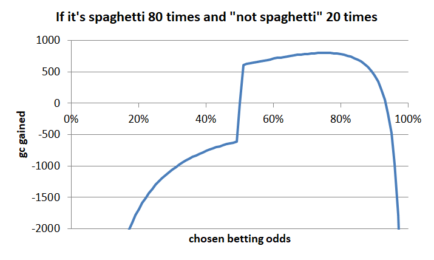
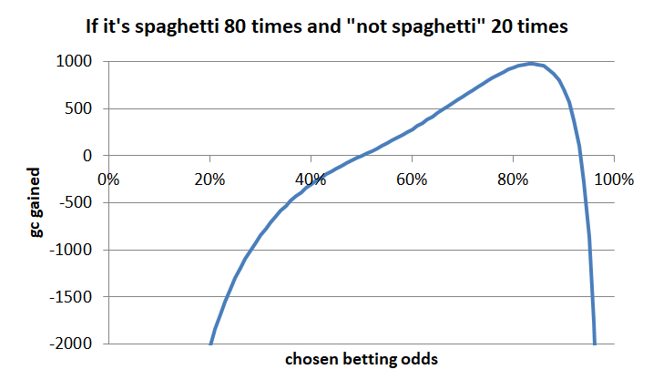

# Rating Predictions on a Continuous Probability Space

## Introduction

[Use Normal Predictions (LessWrong)](https://www.lesswrong.com/posts/GMCs73dCPTL8dWYGq/use-normal-predictions) gives a really good motivation for using normal predictions as an improvement over binary ones. But it doesn't tell us how to rate these predictions in a prediction tournament. I did some thinking on this and feel it shouldn't be too dificult, so I'll try to do my best here to outline my approach. I also might be totally wrong.

## Rating binary predictions

_(long and unnecessary digression. Feel free to skip)_

First, let's think about how to rate binary predictions. I haven't tried to look this up, let's just start at first principles and see where we can get.

Suppose we run a prediction tournament on what'll be for dinner between Alice and Bob. They give us their predictions:

|                            | Alice | Bob  |
|----------------------------|-------|------|
| main dish: spaghetti       | 80 %  | 60 % |
| main dish: mashed potatoes | 20 %  | 40 % |
| desert: vanilla pudding    | 70 %  | 40 % |
| desert: ice cream          | 30 %  | 60 % |

… aaand it turns out it's spaghetti as main dish and ice cream as desert. So how do we now award points to Alice and Bob? 

First, let's simplify the table above a little. As we have only two options for main dish and two for dessert, they are each redundant. So here there's no reason not to just have:

|                                            | Alice | Bob  |
|--------------------------------------------|-------|------|
| main dish: spaghetti (turned out true)     | 80 %  | 60 % |
| desert: vanilla pudding (turned out false) | 70 %  | 40 % |

… without losing any information. Now how do we get the ratings?

Probably we want something like:

1. You get positive points for good predictions and negative for bad ones
2. You want to give more points if you gave a higher probability the right result; so Alice should get a higher score for predicting spaghetti correctly than Bob
3. You want to punish getting predictions wrong; as Alice got the vanilla pudding sorta wrong, you probably want to to assign minus points to her but bonus points to Bob.

One way to deal with this might be to assume Alice and Bob negotiate a bet between each other: Both expect the main dish to be spaghetti, but Alice thinks it's it's more likely than Bob. So knowing their expected probabilities, Bob might agree on getting a 2 in 1 reward ratio conditional on the main dish not being spaghetti. I haven't fully thought this through, but I expect this to get difficult quickly, especially once you consider a tournament with many participants.

So instead, let's simplify to assume a bank is the betting partner for both Alice and Bob, offering 50-50 odds for each prediction as a base rate. So it'll offer a 8:5 reward to Alice for spaghetti being the main dish, but only if Alice also accepts a 2:5 bet if it turns out to not be spaghetti. Also, let's force Alice to accept the bank to place the same amount of points (or money, let's say 10gc because all sensible people bet with gold coins = gc) on her side of the bet, so we get:

* Alice places 10gc on an 80 % chance of spaghetti. The bank gives 80%/50% reward; if it is spaghetti: 16gc gained
* The bank places the same 10gc on a 20% chance of "not spaghetti" and Alice gives 50%/20% odds: so she looses 25gc if it actually is not spaghetti.
* The 10gc cancel out, so actually it's "Alice gets 16gc if it's spaghetti, but looses 25gc if it's not spaghetti".
* Bob places 10gc on a 60 % chance of spaghetti. The bank gives 60%/50% reward; if it is spaghetti: 12gc gained
* The bank places the same 10gc on an 40 % chance of "not spaghetti" and Bob gives 40%/50% odds: so he looses 12.5gc if it actually is not spaghetti.
* The 10gc cancel out, so actually it's "Bob gets 12gc if it's spaghetti, but looses 12.5gc if it's not spaghetti"

If there actually is an 80% chance of spaghetti, we'd expect Alice to be right 4 out of 5 times. So in 100 games, she'll be right approx. 80 times (80 * 16gc gained = 1280gc gained) and she be wrong approx. 20 times (20 * 25gc = 500gc lost), so she'll make 780gc. Bob will get (80 * 12gc = 960gc gain, 20 * 12.5gc loss), so he'll make 410gc. So Alice will be better of by getting the correct probability, but not very much. Suppose Carol wants to join the bet, but she bets on a 40% chance of spaghetti. Let's reverse this and say she bets on a 60% chance of "not spaghetti"; the bank will offer her a deal of 60%/50% on "not spaghetti", but she'll lose 50%/40% if it is spaghetti. Carol will get (80 * -12.5gc + 20 * 12gc = -1000gc + 240gc), so she'll lose 760gc to the bank.

We can plot the gc earned in case of 80 times "it's spaghetti" and 20 times "it's not spaghetti" as a function of the chosen odds:

… which is itself odd, because we get a huge jump at 50%. I didn't expect this, but in retrospect, this makes kinda sense: the bank gives you 50-50 odds on the result being true; but it'll be true 80% of the time, so you win a lot by taking the bank's odds without giving it to your own odds. So unless you specifically want to reward "getting the direction right, but being extremely conservative with betting, this is not what we want. Especially, this is not what we want if we want to encourage people to bet on their true beliefs. What would be better?

Let's get back to our 10gc as amount for base bet. We might increase them linearly based on the percentages involved (with an arbitrary factor to convert % to gc, here 40 to get roughly the same scale):

* base_bet_amount = (estimate - 50%) * (40gc/%)
* reward if true: estimate / 50% * base_bet_amount
* loss if false: 50% / (1 - estimate) * base_bet_amount

Now this is better, but we still have a few issues. One is that maximum gain results not from betting 80% but slightly higher, so we may probably want to use some slightly nonlinear function for base_bet_amount to make this actually hit 80%. One other thing is that the curve looks kinda strange around 50% and I haven't thought implications through. Let's ignore all this and instead just solve our original prediction tournament.

For rating our predictions, we need to calculate the gain and loss functions for 60%, 70% and 80%:

| probability | gain if true | loss if false |
|-------------|--------------|---------------|
| 60%         | 4.80gc          | 5.00gc         |
| 70%         | 11.20gc          | 13.33gc          |
| 80%         | 19.20gc         | 30.00gc              |
… and we get as results:

|                                            | Alice    | Bob     |
|--------------------------------------------|----------|---------|
| main dish: spaghetti (turned out true)     | +19.20gc | +4.80gc |
| desert: vanilla pudding (turned out false) | -13.33gc | +4.80gc |
| total                                      | +5.87gc  | +9.60gc |

So Bob wins the tournament. I think the result roughly matches my intuition, that Alice should get slightly lower points for getting a 70% wrong and an 80% prediction right than Bob for getting two 60% predictions right.

Small interlude: Let's see what typical scoring rules use. Log-loss and brier appear to be the most commonly used ones. Good info is sparse and it took me surprisingly long to find [the corresponding Wikipedia article](https://en.wikipedia.org/wiki/Scoring_rule). Other honorable mentions:

* [https://towardsdatascience.com/intuition-behind-log-loss-score-4e0c9979680a]

In summary, it's surprisingly difficult to come up with a grading function that incentivizes players to bet on their true beliefs and grades results in a way that seems reasonably fair (as in: outcomes do not collide with your intuition). There are still more issues left, for example I'd expect the reward for getting 50% predictions right to be mostly drowned in noise (unless you have really really many questions in a tournament). So in a tournament with a limited amount of questions, players might still chosse a "high risk high reward" strategy of betting extremely high probabilities on 1..3 questions where they are confident these will turn out true: if they actually are, this might be enough to win the tournament even when hedging all other questions very much. I haven't fully thought this through, but this might be a good thing to be studied with monte-carlo simulations or something.

